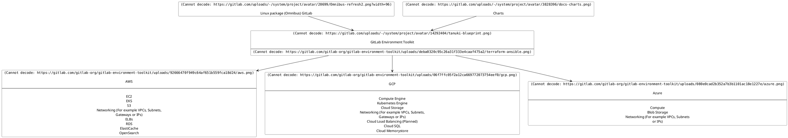

# GitLab Environment Toolkit

The GitLab Environment Toolkit (`GET`) is a set of opinionated [Terraform](https://www.terraform.io/) and [Ansible](https://www.ansible.com/) scripts to assist with deploying scaled self-managed GitLab environments following the [Reference Architectures](https://docs.gitlab.com/ee/administration/reference_architectures).

Created and maintained by the GitLab Quality Engineering Enablement team, the Toolkit supports the following features:

- Support for deploying all [Reference Architectures](https://docs.gitlab.com/ee/administration/reference_architectures) sizes dynamically from [1k](https://docs.gitlab.com/ee/administration/reference_architectures/1k_users.html) to [50k](https://docs.gitlab.com/ee/administration/reference_architectures/50k_users.html).
- Support for deploying Cloud Native Hybrid variants of the Reference Architectures (AWS & GCP only at this time).
- GCP, AWS and Azure (Linux package (Omnibus)) [cloud provider support](TECHNICAL_DESIGN.md#supported-cloud-providers)
- Upgrades
- Release and nightly Linux package (Omnibus) builds support
- Advanced search with OpenSearch
- Geo support
- Container Registry support
- Zero Downtime Upgrades support
- Built-in optional Load Balancing and Monitoring (Prometheus) setup
- SSL / TLS support (either direct or via hooks)
- Alternative sources (Cloud Services, Custom Servers) for select components (Load Balancers, PostgreSQL, Redis)
- On Prem Support (Ansible)
- Custom Config / Tasks / Files support

## Before You Start

The Toolkit can help you with the deployment and maintenance of a self-managed GitLab environment. But please note it does not remove any of the underlying challenges that comes with running large production applications and that ultimately self-managed environments are the responsibility of the user. As such, users are recommended to have a good working knowledge of Terraform, Ansible, GitLab administration and Infrastructure management as well be aware of what running such an environment entails. For users who aren't in this position, our [Professional Services](https://about.gitlab.com/services/#implementation-services) team offers implementation services, but for those who want a more managed solution long term, it's recommended to instead explore our other offerings such as [GitLab SaaS](https://docs.gitlab.com/ee/subscriptions/gitlab_com/) or [GitLab Dedicated](https://about.gitlab.com/dedicated/).

The Toolkit is designed to be flexible, and to follow best practices for GitLab. However, the scripts are opinionated, presented as-is, and may not be compatible with your specific environment build needs. There may be cases where you will need to extend or customize the Toolkit for your unique needs.

Review the Toolkit in full before any use, as it offers no guarantees on topics such as [security](docs/environment_post_considerations.md#security) or data integrity. 

[Further manual setup](docs/environment_post_considerations.md) after deployment may also be required.

## Requirements

The requirements for the Toolkit are as follows:

- GitLab version: `14.0.0` and upwards.
- Terraform `1.5.0` - `1.5.5`
- Ansible `8.0` and upwards (Python `3.9`+)
- OS: Ubuntu 20.04+, Debian 11, RHEL 8, Amazon Linux 2
  - The Toolkit has been designed to target clean OS installations. It may work with existing installations, but this is not currently being tested.
  - Admin access to the OS is also required by GET to install various dependencies.
  - ARM based hardware is supported for Linux package (Omnibus) environments.

## Documentation

- [GitLab Environment Toolkit - Quick Start Guide](docs/environment_quick_start_guide.md)
- [GitLab Environment Toolkit - Preparing the environment](docs/environment_prep.md)
- [GitLab Environment Toolkit - Provisioning the environment with Terraform](docs/environment_provision.md)
- [GitLab Environment Toolkit - Configuring the environment with Ansible](docs/environment_configure.md)
- [GitLab Environment Toolkit - Advanced - Custom Config / Tasks / Files, Data Disks, Advanced Search, Container Registry and more](docs/environment_advanced.md)
- [GitLab Environment Toolkit - Advanced - Cloud Native Hybrid](docs/environment_advanced_hybrid.md)
- [GitLab Environment Toolkit - Advanced - Component Cloud Services / Custom (Load Balancers, PostgreSQL, Redis)](docs/environment_advanced_services.md)
- [GitLab Environment Toolkit - Advanced - SSL](docs/environment_advanced_ssl.md)
- [GitLab Environment Toolkit - Advanced - Network Setup](docs/environment_advanced_network.md)
- [GitLab Environment Toolkit - Advanced - Geo](docs/environment_advanced_geo.md)
- [GitLab Environment Toolkit - Advanced - Monitoring](docs/environment_advanced_monitoring.md)
- [GitLab Environment Toolkit - Upgrades (Toolkit, Environment)](docs/environment_upgrades.md)
- [GitLab Environment Toolkit - Considerations After Deployment - Backups, Security](docs/environment_post_considerations.md)
- [GitLab Environment Toolkit - Troubleshooting](docs/environment_troubleshooting.md)

### Config Examples

[Full config examples are available for select Reference Architectures](examples).

## How To Use

The Toolkit's Terraform and Ansible scripts can be used in various ways depending on your requirements:

- Terraform - Source (git checkout), [Docker](docs/environment_provision.md#4-run-the-gitlab-environment-toolkits-docker-container-optional), [Module Registry](docs/environment_provision.md#terraform-module-registry)
- Ansible - Source (git checkout), [Docker](docs/environment_configure.md#3-run-the-gitlab-environment-toolkits-docker-container-optional), [Collection](docs/environment_configure.md#running-with-ansible-collection-optional)

Refer to the docs above for full instructions on each.

## How It Works

At a high level the Toolkit is designed to be as straightforward as possible. A high level overview of how it works is as follows:

- Machines and associated infrastructure are _provisioned_ as per the [Reference Architectures](https://docs.gitlab.com/ee/administration/reference_architectures) with Terraform. Part of this provisioning includes adding specific labels / tags to each machine for Ansible to then use to identify.
- Machines are _configured_ with Ansible. Through identifying each machine by its labels / tags, Ansible will go through them in the correct installation order. On each it will install and configure the Linux package (Omnibus) to set up the intended component as required. The Ansible scripts have been designed to handle certain dynamic setups depending on what machines have been provisioned (e.g. an environment without OpenSearch, or a 2k environment with a smaller amount of nodes). Additional tasks are also performed as required such as setting GitLab config through Rails or Load Balancer / Monitoring setup.

## Troubleshooting

Please refer to our [Troubleshooting guide](docs/environment_troubleshooting.md) if you are having issues deploying an environment with the Toolkit.

## Support

Technical support is only available for the current Toolkit major version and requests should be raised via the [Support team](https://about.gitlab.com/support/).

Issues specific to the Toolkit code can also be raised in our tracker.

## Feature Requests

The Toolkit is opinionated by necessity, as there is a vast amount of options and permutations available when deploying infrastructure across various Cloud Providers or on-prem. 

Consequently, during our independent review of feature requests, we might determine that some are not feasible to implement according to Toolkit's opinionated approach. In some cases, it could be more straightforward and quicker for you to tackle it separately.

However, we do welcome Feature Requests that could be valuable to add for other users. If you have such a request please raise it in [our tracker](https://gitlab.com/gitlab-org/gitlab-environment-toolkit/-/issues), but we do ask that you check beforehand to see if it's already been raised.

### Features that won't be covered

Due to complexities, permutations or areas best left to be configured directly we do not plan to include the following:

- Cloud accounts management
- Observability stack beyond Prometheus
- Direct OmniAuth and Email support
- DNS server management
- Full GitLab agent server for Kubernetes (KAS) setup
- [Downgrades](https://docs.gitlab.com/ee/update/package/downgrade.html)

Some of the above areas are better tackled via [Custom Config](docs/environment_advanced.md#custom-config).

### Contributions

This project accepts contributions to existing features. Refer to the [Contributing guide](CONTRIBUTING.md) for more information.

## Licensing

Requires [GitLab Premium](https://about.gitlab.com/pricing/) or above.

Released under the [GitLab EE license](LICENSE).
